## Нужно будет разработать проект - Автонарушители.

### В системе существуют три роли. Обычные user, admin, supervisor.

- Пользователь может добавлять accidents.

- Админ может добавлять доп. статьи, типы инцидента и изменять их

- Supervisor закрывает инциденты

- В заявлении указывает: адрес, номер машины, описание нарушения, фотографию нарушения, статус соответсвующий закон и тип инцидента.

- У заявки есть статус. В процессе. Завершена. Может только завершать supervisor, если user попытается это сделать, 

- ему придет сообщение с ошибкой 403 forbidden 

- Вид системы. Главная страница - это поиск с таблицей.

- Так же присутствуют списки со статьями и инцидентами. 

- Они доступны только admin, это страница /adminView, для более упрощенного использования всех функций

- Так же для регистрации админа присутствует /redAdmin для упрощения 

- Под этот проект создайте новый репозиторий job4j_car_accident

## Стек технологий:


## Контакты
[](https://t.me/romanka3)

### chansforman@gmail.com

## Перед запуском установите:

- Java 17
- Apache Maven 3.x
- Postgres 14


## Запуск приложения

1. Создать бд:
```sql
create database job4j_car_accident;
```

2. Запуск приложения с maven. Перейдите в корень проекта через командную строку и выполните команды:
```
    mvn clean install
    mvn spring-boot:run
```
3. Запустить ссылку http://localhost:8080/index

Сначало нужно пройти регистрацию перейти, зарегистрироваться как user или admin через /regAdmin 

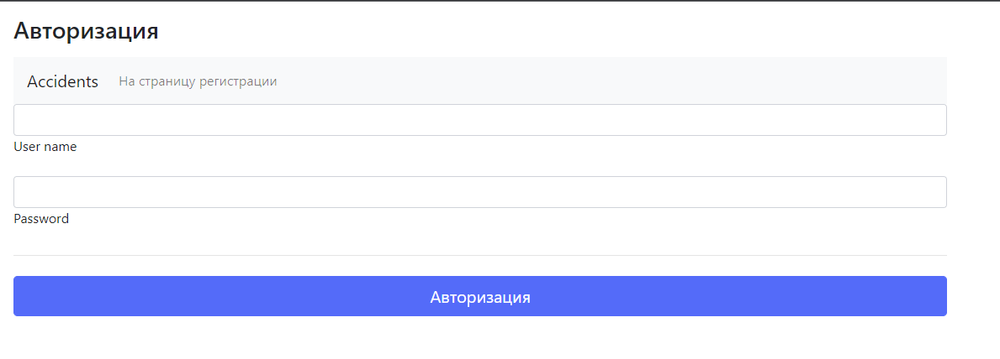

После авторизации вы попадете на стартовую страницу 

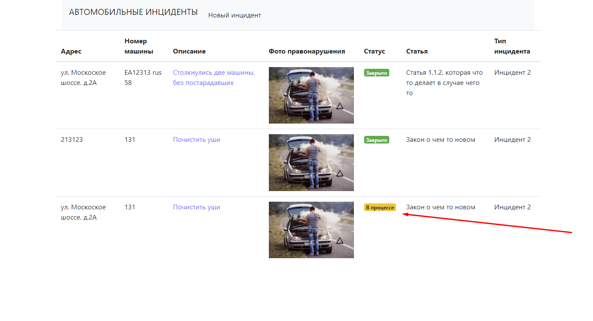

Где можете создать новый accident

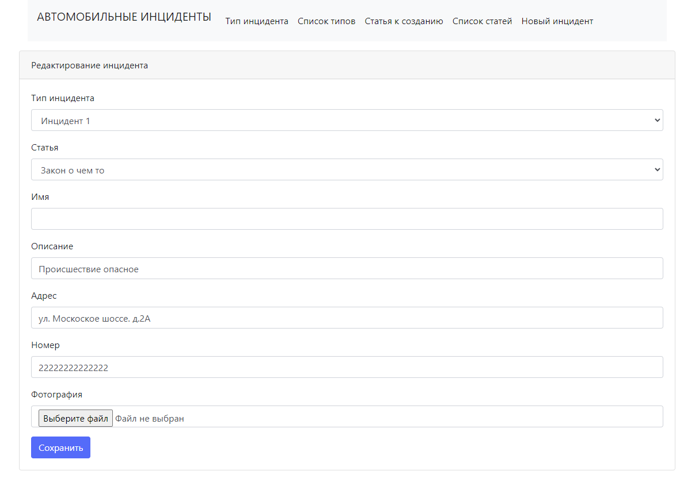

После чего перейти по ссылки 

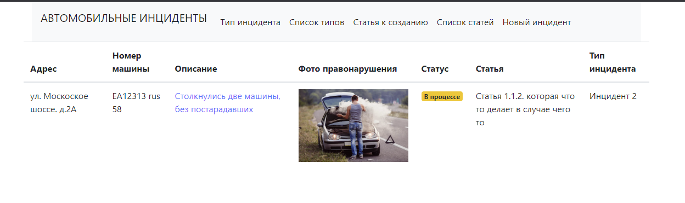

Внести изменения и сохранить 

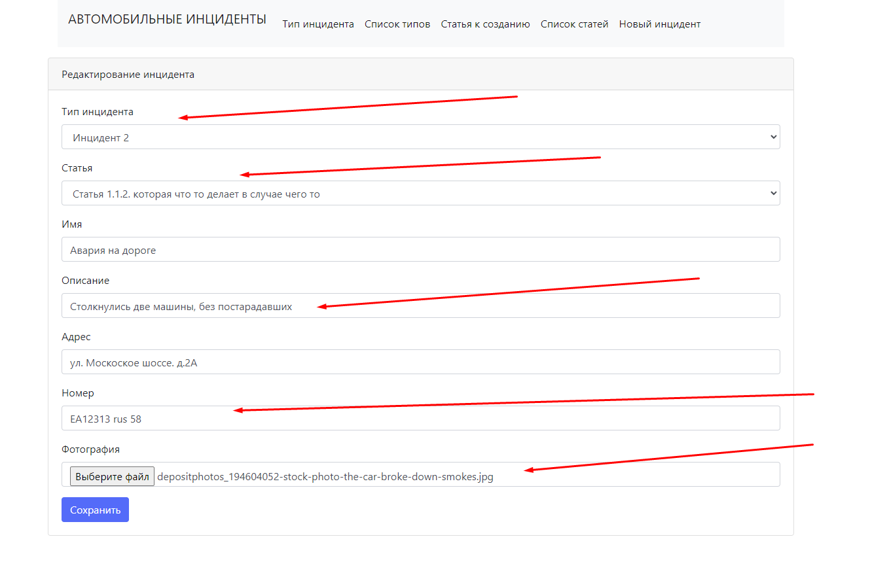

Для создания или обновления обьектов rule, accidentType нужно перейти по ссылке в качестве роли ADMIN

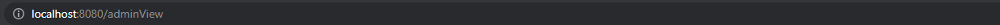

После перехода откроется ссылка на все возможные функции

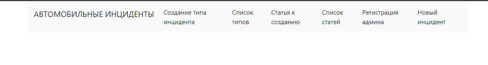

Создание 

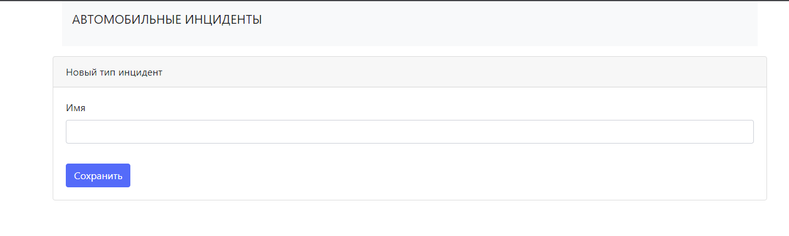

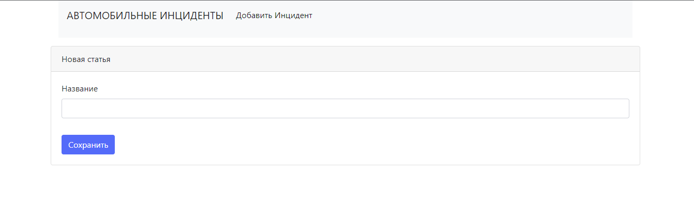

Обновление для удобства оно превращено используется список  

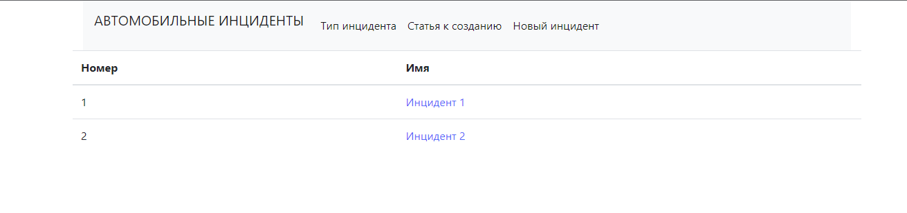

Где можно перейти по ссылке и изменить данный параметр

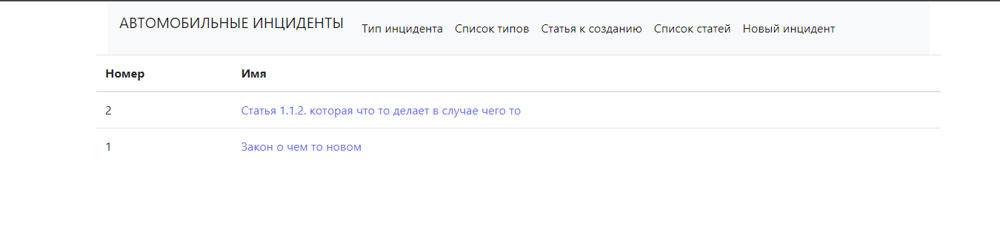

Созданные заявки закрывает supervisor, чтобы ее закрыть нужно иметь роль ADMIN или SUPERVISOR. USER МОЖЕТ ТОЛЬКО ИХ СОЗДАВАТЬ!!


После перехода нужно нажать подтвердить после чего заявка будет считаться закрытой

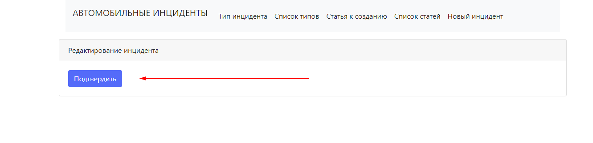

Закрытая заявка

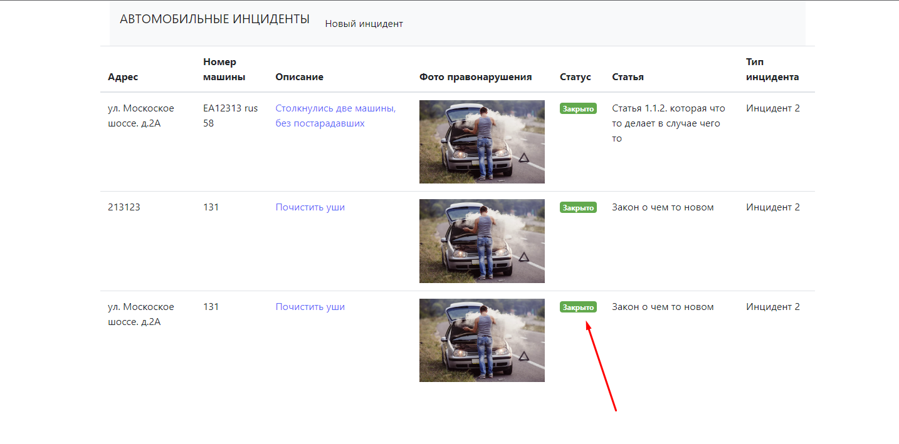